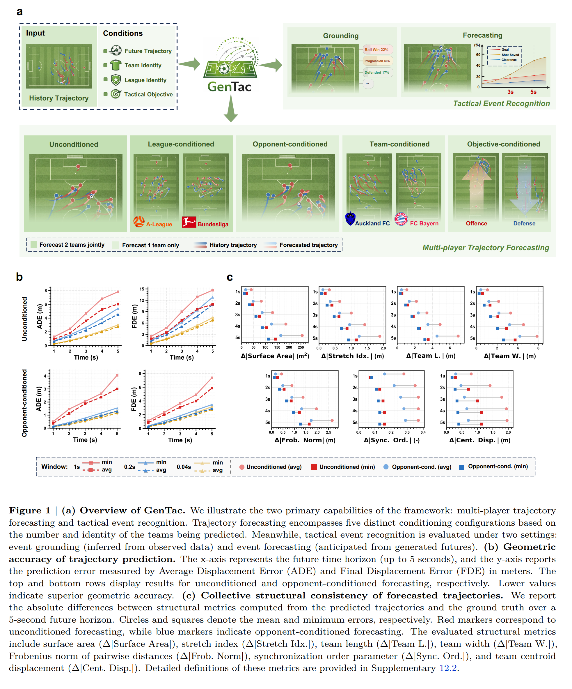

# GenTac

Official repository for **GenTac: Generative Modeling and Forecasting of Soccer Tactics**.

**Authors:** Jiayuan Rao, Tianlin Gui, Haoning Wu, Yanfeng Wang, Weidi Xie  
**Paper:** [arXiv](https://arxiv.org/abs/2604.11786) | [PDF](https://arxiv.org/pdf/2604.11786) | [Project Page](#)



GenTac is a diffusion-based framework for modeling open-play soccer tactics as stochastic multi-agent trajectories and semantic tactical events. Given historical tracking context, GenTac can generate diverse long-horizon futures, condition rollouts on teams/leagues/opponents/objectives, and forecast tactical outcomes from the generated plays.

## Highlights

- Generative forecasting for multi-player soccer trajectories.
- Context-conditioned tactical simulation across teams, leagues, opponents, and strategic objectives.
- Tactical event grounding with a 15-class event space.
- Evaluated on TacBench for geometric accuracy, structural consistency, style control, counterfactual simulation, and tactical outcome prediction.

## Release Progress

| Item | Status |
| --- | --- |
| Paper | Released |
| Figures | Released |
| Project page | Coming soon |
| Code | Coming soon |
| Data / TacBench | Coming soon |
| Pretrained models | Coming soon |

## Citation

```bibtex
@article{rao2026gentac,
  title={GenTac: Generative Modeling and Forecasting of Soccer Tactics},
  author={Rao, Jiayuan and Gui, Tianlin and Wu, Haoning and Wang, Yanfeng and Xie, Weidi},
  journal={arXiv preprint arXiv:2604.11786},
  year={2026}
}
```
